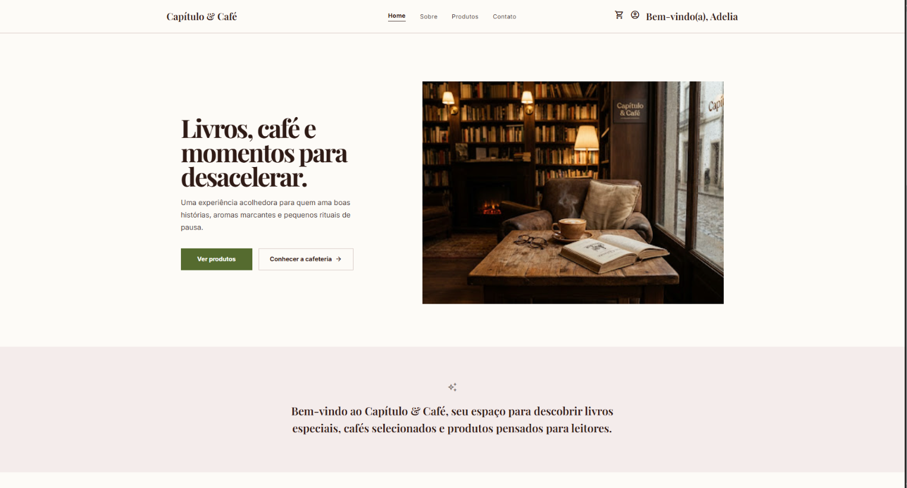

# 📚☕ Capítulo & Café


<p align="center">
  
</p>

O **Capítulo & Café** é um e-commerce fictício de uma livraria com cafeteria integrado, desenvolvido como projeto final da unidade curricular do **SENAI CTTI**.

A aplicação simula uma experiência completa de compra, permitindo cadastro e autenticação de usuários, navegação pelo catálogo de produtos, visualização de detalhes, gerenciamento de carrinho e persistência local dos dados utilizando apenas **HTML, CSS e JavaScript**.

---

# 🖥️ Sobre o projeto

O sistema foi desenvolvido sem frameworks front-end, utilizando apenas JavaScript moderno com **ES Modules**, tendo como foco a organização do código e boas práticas de desenvolvimento.

Durante o desenvolvimento foram aplicados conceitos como:

* Organização modular do JavaScript.
* Separação de responsabilidades.
* Manipulação de DOM.
* Persistência de dados no navegador.
* Autenticação simples.
* Proteção de rotas.
* Componentização.
* Utilização do Vite como ferramenta de build.

---

# 🎯 Objetivos

* Praticar JavaScript moderno (ES Modules).
* Aplicar separação de responsabilidades.
* Desenvolver uma aplicação Multi Page Application (MPA).
* Criar componentes reutilizáveis.
* Manipular dados utilizando `localStorage` e `sessionStorage`.
* Simular um fluxo completo de um e-commerce.

---

# ✨ Funcionalidades

## 👤 Autenticação

* Cadastro de usuários.
* Validação de usuário (mínimo de 5 caracteres).
* Validação de senha (mínimo de 8 caracteres e pelo menos um caractere especial).
* Login.
* Sessão utilizando `sessionStorage`.
* Proteção das páginas internas.

## 📚 Catálogo de produtos

* Produtos padrão carregados automaticamente na primeira execução.
* Cadastro de novos produtos.
* Ordenação A-Z e Z-A.
* Exclusão do último produto cadastrado.
* Página de detalhes.
* Controle de quantidade.

## 🛒 Carrinho

* Adicionar produtos.
* Alterar quantidade.
* Remover itens.
* Atualização automática do subtotal.
* Atualização automática do total.
* Aplicação demonstrativa de cupom.
* Simulação de checkout.
* Tela de carrinho vazio.

## 🔔 Notificações

Toda a aplicação utiliza **SweetAlert2** para exibição de mensagens de:

* Sucesso
* Erro
* Aviso
* Informação

---

# 🚀 Tecnologias utilizadas

| Tecnologia              | Finalidade                            |
| ----------------------- | ------------------------------------- |
| HTML5                   | Estrutura das páginas                 |
| CSS3                    | Estilização e responsividade          |
| JavaScript (ES Modules) | Lógica da aplicação                   |
| Vite                    | Bundler e servidor de desenvolvimento |
| SweetAlert2             | Alertas visuais                       |
| localStorage            | Persistência dos dados                |
| sessionStorage          | Sessão do usuário                     |

---

# 📁 Estrutura do projeto

```text
sistema-web-livraria-cafe/
├── index.html
├── vite.config.js
├── package.json
└── src/
    ├── assets/
    ├── pages/
    │   ├── home.html
    │   ├── products.html
    │   ├── product-detail.html
    │   ├── cart.html
    │   ├── about.html
    │   ├── contact.html
    │   └── signup.html
    ├── style/
    │   ├── app.css
    │   ├── global.css
    │   └── pages/
    │       ├── home.css
    │       ├── products.css
    │       ├── product.css
    │       ├── cart.css
    │       ├── about.css
    │       ├── contact.css
    │       └── login.css
    └── scripts/
        ├── app.js
        ├── auth.js
        ├── components/
        │   └── productCard.js
        ├── pages/
        │   ├── home.js
        │   ├── products.js
        │   ├── product-detail.js
        │   └── cart.js
        ├── services/
        │   ├── storage.js
        │   ├── productService.js
        │   └── cartService.js
        └── utils/
            ├── formatters.js
            └── validation.js
```

---

# 🏗️ Arquitetura do código JavaScript

```text
Aplicação
│
├── app.js
│
├── Pages
│   ├── Home
│   ├── Produtos
│   ├── Detalhes
│   └── Carrinho
│
├── Components
│
├── Services
│
└── Utils
```

### Organização

**services/**

Responsáveis pelo acesso e manipulação dos dados.

**pages/**

Controladores de cada página.

**components/**

Componentes reutilizáveis da interface.

**utils/**

Funções auxiliares como validações e formatações.

**app.js**

Inicializa a aplicação, identifica a página atual e protege as rotas privadas.

---

# 🔧 Como executar o projeto

## Pré-requisitos

* Node.js 18 ou superior
* npm

## Instalação

```bash
git clone https://github.com/Livedriven/sistema-web-livraria-cafe.git

cd sistema-web-livraria-cafe

npm install

npm run dev
```

A aplicação será iniciada normalmente em:

```text
http://localhost:5173
```

## Outros comandos

```bash
npm run build

npm run preview
```

---

# 🧭 Fluxo de uso

1. Faça login ou crie uma conta.
2. Acesse a Home.
3. Navegue pelo catálogo.
4. Visualize os detalhes do produto.
5. Adicione itens ao carrinho.
6. Ajuste as quantidades.
7. Finalize a compra (simulada).

---

# 💾 Persistência de dados

Os dados são armazenados localmente no navegador.

| Armazenamento  | Utilização                    |
| -------------- | ----------------------------- |
| localStorage   | Produtos, usuários e carrinho |
| sessionStorage | Sessão do usuário autenticado |

> Os dados permanecem apenas no navegador utilizado e podem ser removidos caso o armazenamento local seja limpo.

---

# 💡 Melhorias futuras

* Integração com API REST.
* Backend em Node.js.
* Banco de dados relacional.
* Upload de imagens.
* Pesquisa de produtos.
* Paginação.
* Lista de favoritos.
* Histórico de pedidos.
* Área administrativa.
* Dashboard de vendas.

---

# 🎓 Contexto acadêmico

Este projeto foi desenvolvido como trabalho final de unidade curricular do **SENAI CTTI**, aplicando conceitos de desenvolvimento web front-end, organização modular de código JavaScript e utilização do Vite como ferramenta de build.

---

# 👨‍💻 Autor

**Rick**

GitHub:

https://github.com/Livedriven

---

# 📄 Licença

Este projeto está licenciado sob a licença **ISC**, conforme definido no arquivo `package.json`.
